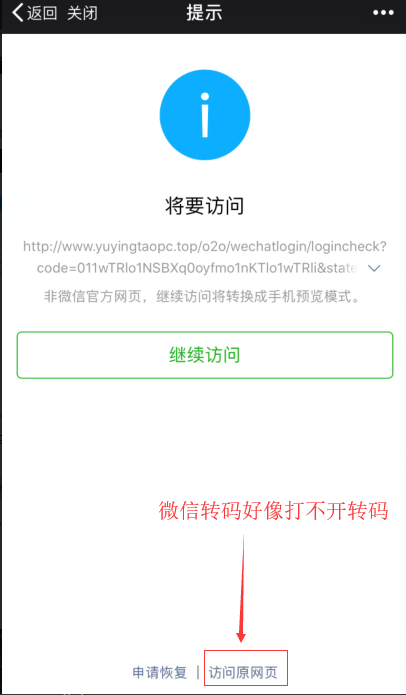

# 校园商铺管理
根据[慕课网的SSM到Spring Boot - 从零开发校园商铺平台](https://coding.imooc.com/class/chapter/144.html#Anchor)学习开发  
目前只完成了1.0部分，即SSM构架部分  
老师讲解的非常细致，但是知识点还得看书，或者API文档，会有更大的收获，直接上手实战难度还是比较高的。

项目基于SSM框架进行代码开发  
使用Maven 3.3.9进行包管理  
关系数据库:mysql,缓存数据库:redis  
jdk版本1.8  
前端UI框架基于阿里巴巴开源的[SUI Mobile](http://m.sui.taobao.org/)  
开发工具：IntelliJ IDEA 2017  
Linux版本：CentOS 7  SSH连接工具SecureCRT  

demo演示  
1.  关注测试版公众号  
  
2.  在微信客户端访问[https://open.weixin.qq.com/connect/oauth2/authorize?appid=wx6fc211b53bb339e3&redirect_uri=http://www.yuyingtaopc.top/o2o/wechatlogin/logincheck&response_type=code&scope=snsapi_userinfo&state=1#wechat_redirect]

学习到现在出现了很多问题，有时候一个小问题能卡一两天，有条件就Google，没条件百度也能找到答案，基本在CSDN都有前辈踩过坑。  

代码有问题的地方欢迎交流，共同学习，不断进步！